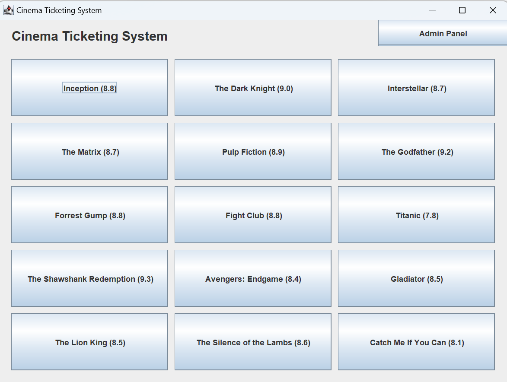
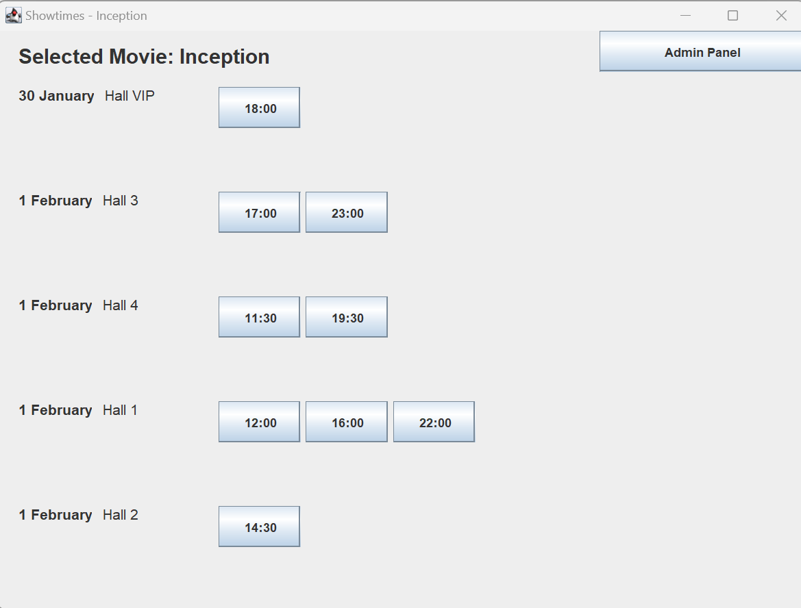
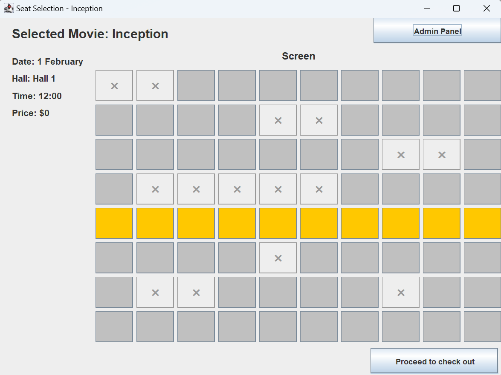
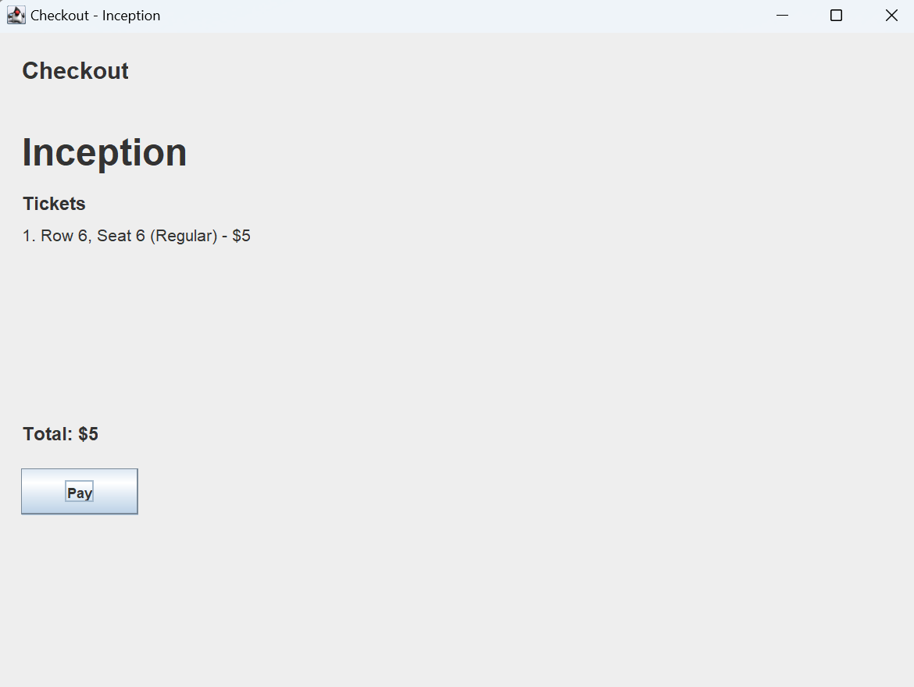
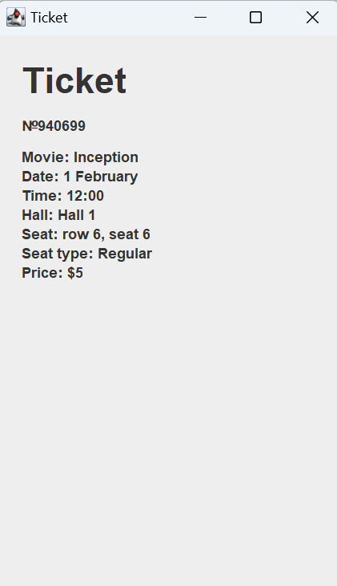
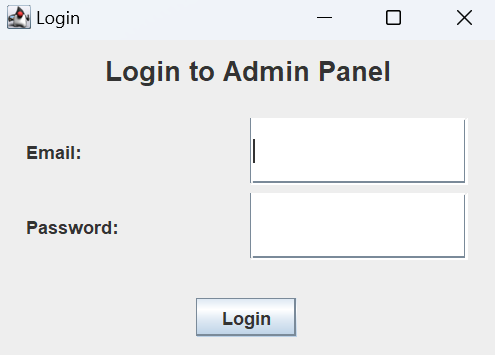
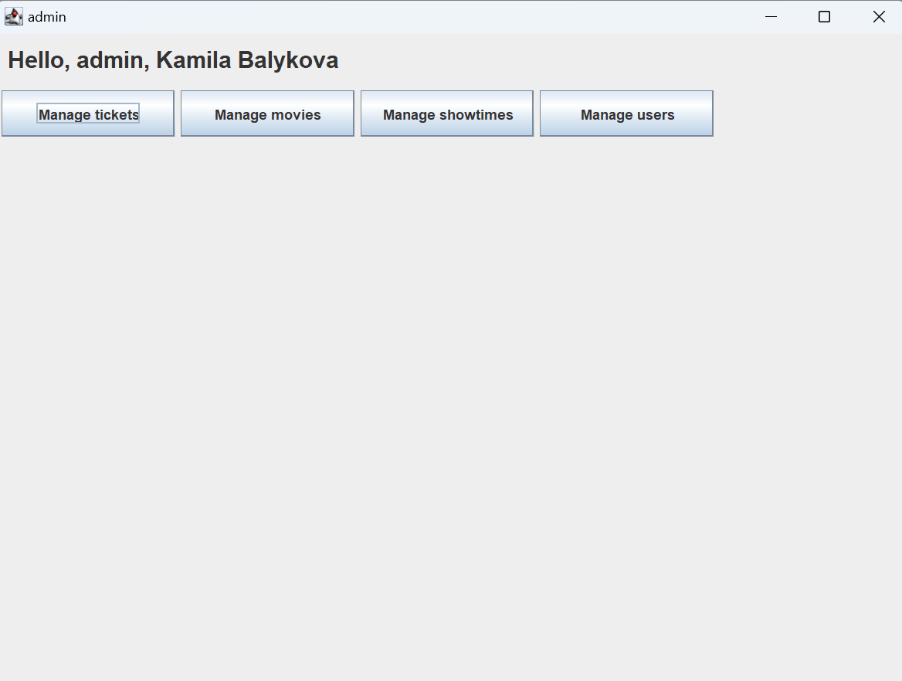
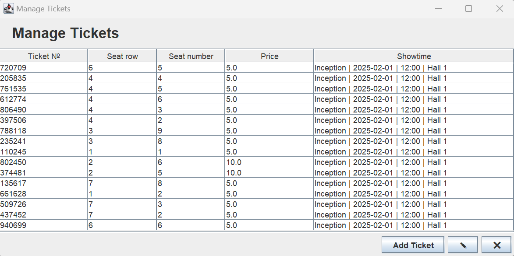
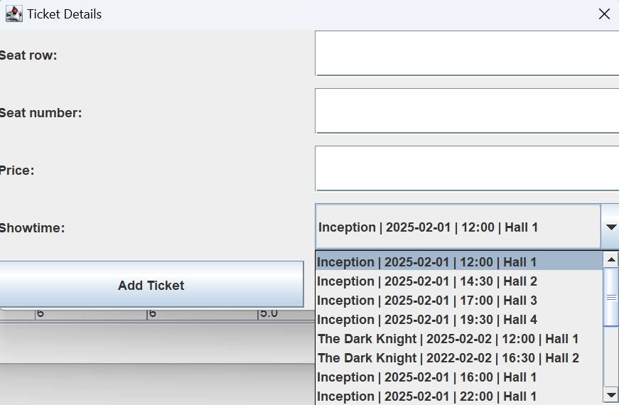

# Cinema Ticketing System

## Project Description
The Cinema Ticketing System is a desktop Java application designed to manage movie showtimes, seat selection, ticket purchasing, and cinema administration. The application uses Swing for its user interface, JDBC for database connectivity, and PostgreSQL as its database backend. It supports different roles (admin, manager, staff) for various administrative functions. It follows an MVC (Model-View-Controller) pattern to maintain a structured architecture, ensuring scalability and maintainability.

---
## Setup and Installation
### Prerequisites
- **Java JDK 11+** (tested with OpenJDK 23)
- **Maven** (for building the project and managing dependencies)
- **PostgreSQL** database

### **1. Clone the Repository**
```sh
git clone https://github.com/your-repo/cinema-ticketing-system.git
cd cinema-ticketing-system
```

### **2. Configure Database**
1. Create a PostgreSQL database and import the schema provided in `cinema_db.sql`.
2. Update `DBConnectionManager.java` with your database credentials:
```java
private static final String URL = "jdbc:postgresql://localhost:5432/cinema_db";
private static final String USER = "your_username";
private static final String PASSWORD = "your_password";
```
Alternatively, you can simply use the `.env` file provided in the project submission, which contains the connection settings for an online-hosted database.
### **3. Run the Application**
```sh
mvn clean compile exec:java
```

---
## Database Schema
The system follows a relational database model with the following key tables:

- **users**: Stores user credentials and roles.
- **movies**: Holds movie details.
- **halls**: Represents cinema halls.
- **showtimes**: Stores movie schedules linked to halls and movies.
- **seats**: Represents seats in different halls.
- **tickets**: Stores ticket information linked to showtimes and seats.

---
## Main Classes Overview
### 1. **Controllers (Controller Layer)**
These classes handle user interactions and coordinate between the UI and DAO layer:
- `MovieController` - Handles movie-related logic.
- `SeatsController` - Manages seat selection and availability.
- `ShowtimesController` - Controls showtime-related operations.

### 2. **Entities (Model Layer)**
These classes represent database tables:
- `Users` - Represents system users with attributes like `userId`, `name`, `email`, `password`, and `role`.
- `Movies` - Stores movie information such as `movieId`, `title`, `genre`, and `rating`.
- `Halls` - Represents cinema halls with `hallId`, `name`, and `capacity`.
- `Showtimes` - Stores movie showtimes with attributes like `showtimeId`, `movieId`, `hallId`, `showDate`, and `showTime`.
- `Seats` - Represents individual seats in a hall.
- `Tickets` - Stores ticket information linked to `showtimeId` and `seatId`.

### 3. **Data Access Objects (DAO Layer)**
These classes handle database interactions:
- `UsersDAO` - Handles user authentication and management.
- `MoviesDAO` - Manages CRUD operations for movies.
- `ShowtimesDAO` - Manages showtime records.
- `SeatsDAO` - Retrieves seat information.
- `TicketsDAO` - Manages ticket records.
- `HallsDAO` - Manages cinema hall details.

### 4. **User Interface (View Layer)**
Implemented using **Java Swing**:
- `LoginFrame` - Handles user authentication.
- `MainFrame` - Serves as the entry point of the system, allows users to select movies.
- `AdminPanelFactory` - Generates different admin panels based on user roles.
- `AdminPanelFull` - Complete access panel for admins.
- `ManagerPanel` - Limited access panel for managers.
- `StaffPanel` - Restricted access panel for staff.
- `ManageMoviesFrame` - Allows movie management.
- `MovieForm` - A form for adding or editing movie details.
- `ManageShowtimesFrame` - Enables showtime management.
- `ShowtimeForm` - A dialog window for managing showtimes.
- `ManageTicketsFrame` - Allows ticket management.
- `TicketForm` - A dialog window for adding or editing tickets.
- `ManageUsersFrame` - Admin panel for managing users.
- `UserForm` - A form for adding or updating user details.
- `CheckoutFrame` - Handles ticket purchasing process.
- `SeatSelectionFrame` - Allows users to select seats for a specific showtime.
- `ShowtimesFrame` - Displays available showtimes for a specific movie.
- `TicketFrame` - Displays ticket details.

---
## Screenshots
### 1. MainFrame


### 2. ShowtimesFrame


### 3. SeatSelectionFrame


### 4. CheckoutFrame


### 5. TicketFrame


### 6. Login to Admin Panel


### 7. Admin Panel (logged in as an admin)


### 8. Manage Tickets


### 8.1 Add/Edit Form



